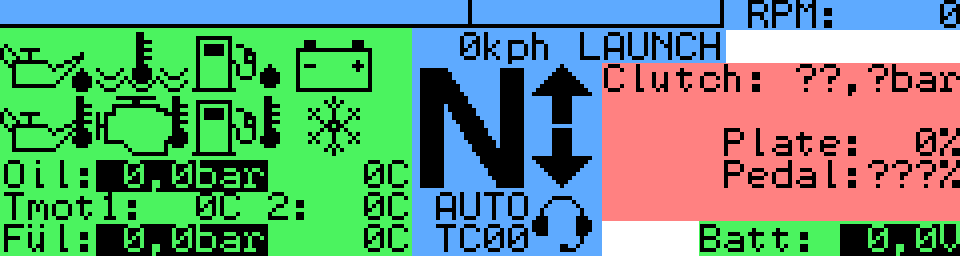

Welcome to the manual for the Einstein Motorsport Dashboard. The dashboard is designed to be easy to use, and customizable for any application. This manual is divided into three sections. [Usage](#usage) describes how to use the dashboard's current firmware. [Customizing](#customizing) describes how to customize the dashboard. [Programming](#programming) describes the architecture of the firmware and the functions available to customizers.

# Usage

## Main Screen

The main screen is divided into three sections:
* Car Information (green)
* Driver Information (blue)
* Mode Area (red)

### Car Information

This sections displays the measurements and status of the car's systems. Warning icons are displayed when certain thresholds are exceeded. When an icon is displayed, the corresponding measurement is drawn with inverted color.

Display of the section is handled by `src/warn.c`.

#### Measurement Description
The meaning of each measurement icon is described below. The table describes the icons in left to right, top to bottom order. The "Variable" column tells which canvar is monitored. The "Limit" column is the constant in `src/limits.h` which controls the value at which it should happen.

Variable | Limit | Displayed when
-------- | ----- | --------------
poil | LIM_OIL_PRESSURE_MIN | Oil pressure is too low.
tmot2 | LIM_WATER_TEMP_MAX | Cooling water temperature is too high.
pfuel | LIM_FUEL_PRESSURE_MIN | Fuel pressure is too low.
ub | LIM_BATTERY_MIN | Battery voltage is too low (as measured by ECU).
toil | LIM_OIL_TEMP_MAX | Oil temperature is too high.
tmot | LIM_BLOCK_TEMP_MAX | Engine temperature is too high.
tfuel | LIM_FUEL_TEMP_MAX | Fuel temperature is too high.
toil | LIM_OIL_TEMP_MIN | Engine oil temperature is too low.

### Driver Information

This area displays status and measurements important to the driver. Display of this section is handled by `src/drive.c`.

The following measurements are displayed:

* The RPM bar and current engine RPM (`nmot`) are displayed the top of the screen. When the current RPM exceeds the optimal RPM (illustrated by the black line), the entire screen flashes to prompt the driver to upshift. This is configurable in `src/limits.h` as well.
* Current gear (`gear`) is displayed in the center of the screen.
* If the upshift paddle on the wheel is pressed (`wb_upshift != 0`), an up arrow is displayed next to the gear indicator.
* If the downshift paddle on the wheel is pressed (`wb_downshift != 0`), a down arrow is displayed next to the gear indicator.
* If automatic shifting is enabled (`B_autoshiften_ems != 0`), AUTO is displayed below the gear indicator.
* Current speed (`speed`) is displayed above the gear indicator.
* If launch control is active (`B_launch != 0`), LAUNCH is displayed next to the current speed.
* If the radio button on the wheel is pressed (`wb_radio != 0`), a headset icon is displayed.
* Current traction control level (`wb_traction_knob`) is displayed at the bottom center of the screen.

### Mode Area

This area displays various other pieces of information, in several different modes. The mode is switched using the dash mode button on the wheel. The available modes are described below, in selection order.

CAN Status mode is handled in `canvar.c`, Firmware Version mode is handled in `src/version.c`, and all other modes are handled in `src/modes.c`.

#### Firmware Version

This page displays the firmware versions of the dashboard and wheelboard. The first number is the Git commit hash the firmware was built from, and the second number is the time it was built in YYYYMMddhhmm format. It is displayed briefly at startup, then the dashboard automatically switches to the next mode.

#### Clutch and Throttle

This page displays the clutch system pressure (`pclutch`). It also displays the position of the throttle pedal (???) and the throttle plate (`ath`).

#### CAN Status

This page displays the status of the CANBUS engine. If there is an error, this page is automatically shown. It also displays the current CPU usage of the dashboard processor. All messages will be processed, so high CPU usage will not result in incorrect operation. High CPU usage may slow down display updates; however, the latest data will always be shown. This is not a problem unless the CPU usage is 100% for long periods of time.

# Customizing

This section contains the specific steps required to perform customizations to the firmware.

The following tasks are covered:
* Adding a Canvar
* Adding a Picture
* Writing a Canvar Callback
* Writing a Mode Function

## Adding a Canvar

Canvar definitions are stored in `can/canvars.py` as Python objects. Adding a canvar is done by instantiating a Python `Variable` object and adding it to the list of `variables` in the file. Once this is completed, the variable can be used. If `<name>` is the variable's name, `cv_<name>` is the data structure which holds its value (a `canvar_state_t`) and `CV_ID_<name in uppercase>` is defined as its ID in the data structure array.

The `Variable` constructor has the following arguments:
* `name` is the name of the variable.
* `msg_id` is the 11-bit CAN message ID which contains the variable. If `None`, the variable has no associated ID and can only set with `app_canvar_interrupt`. The message is processed as little endian.
* `size` is the size, 1-32 bits, of the variable.
* `start` is the start, 0-63 bits, of the variable within the message. Bit 0 is LSB of byte 0 in the message, and bit 63 is MSB of byte 7 in the message.
* `signed=False`: if True, the variable is sign-extended to 32 bits.
* `multiplex=None` is the Multiplexer Value for this variable. If None, the message is not multiplexed.
* `callback=None` is the C function to call when this variable is updated with a new value. If None, nothing is called.

## Adding a Picture

Picture definitions are stored in `pics/piclist.py` as Python objects. Adding a picture is done by instantiating a Python `Picture` object and adding it to the `piclist` in the file. Once this is completed, the picture can be used. If `<name>` is the picture's name, its ID is defined as `PIC_ID_<name in uppercase>`. 

The `Picture` constructor has the following arguments:
* `path` is the file system path to the PNG file with the image data, relative to `pics/`.
* `name` is the name of the picture.
* `area=None` is the area of the original image to use, or None to use the whole image. It is a tuple with the following numbers, in pixels: `(<upper left corner of picture, x coordinate>, <upper left corner of picture, y coordinate>, <picture width>, <picture height>)`.

## Writing a Canvar Callback

When a canvar is changed, its callback is called to act on that change.

Callback functions have the following prototype: `void callback(uint32_t val)`, where `val` is the value of the canvar at the time the callback is called. It is sign or zero extended to 32 bits according to the `signed` parameter of the `Variable`.

The callback likely wants to change the screen based on the value of the canvar. Standard C functions like `sprintf` can be used to build the value, and the screen functions covered elsewhere can be used to update the screen. If the callback updates the screen in the mode area, it should check that `app_mode_change_func` equals the correct function, so that it only draws if the mode is actively being displayed.

The callback function is called with interrupts enabled. Interrupts can be disabled when necessary, but they should be enabled while screen functions are called.

If you want the canvar function to be called the next time the canvar is refreshed, even if the new value is the same as the old one, call `CV_CALL_NEXT_UPDATE(cv_<name>)` at the end of the function with interrupts disabled. Operations on other canvars are also possible.

## Writing a Mode Function

A mode function handles displaying and updating a dash mode. It has two jobs: to prepare the mode area of the screen for the current mode, and to update `app_mode_change_func` with the pointer to the next mode function.

Mode functions have the following prototype: `void mode_func(bool next)`. If `next` is `true`, the function should set `app_mode_change_func` to the next mode function and return. If `false`, the function can prepare the screen.

Preparing the screen usually involves drawing placeholder values and labels. The mode function should also call `CV_RENEW(cv_<name>)` with all of the canvars which are displayed in that mode, so that they will be immediately redrawn.

# Programming

This section explains how the firmware works and the functions available to customizers.

The firmware is divided into four distinct sections:
* Application and Main Loop
* Canvar System and Variable Handlers
* Screen
* Platform

## Application and Main Loop

The application receives the timer interrupt and contains the main loop. The main loop calls the variable handlers when there are new values.

The application is responsible for dash mode changes. It clears the screen in preparation for a mode change and calls the appropriate functions to coordinate the change. The variable `app_mode_change_func` should point to the mode change function. More details are in the customizer manual.

The application code is contained in `src/app.c`. This file also has helper routines which may be useful across the application.

### Application Operations

The following operations change the state of the application:
* `void app_show_next_mode(void)` shows the next dash mode by clearing the mode area of the screen, then calling the function pointed to by `app_mode_change_func` with a `false` value.

The following helper routines are available:
* `uint32_t hysteresis(uint32_t old, uint32_t new, uint32_t max_delta)` applies hysteresis to a value. If the difference between `new` and `old` is greater than `max_delta`, the function returns `new`. Otherwise, it returns `old`. `old` should be the previous return value of the function.
* `uint32_t hysteresis_div(uint32_t old, uint32_t new, uint32_t divisor)` applies hysteresis to `new`, then returns it divided by `divisor`. `divisor` must be a multiple of 4, or the returned value will be incorrect. `old` should be the previous return value of the function; it has already been divided.

## Canvar System and Variable Handlers

The canvar (CAN variable) system is responsible for parsing incoming CAN messages and storing new variable values in memory. The main loop then calls a function for each variable that acts on its new value.

Canvars are defined in the canvar database. Defining a new canvar is covered in the customizer manual.

The canvar processor is contained in `src/canvar.c`. The canvar database is automatically generated by `can/canvars.py`. The generated canvar database is contained in `src_gen/canvar_defs.c` and `src_gen/canvar_defs.h`.

### Canvar Operations

NOTE: All canvar operations must be done with interrupts disabled!

If a canvar has a specific `<name>`, then `cv_<name>` is the data structure which holds its value (a `canvar_state_t`) and `CV_ID_<name in uppercase>` is defined as its ID in the data structure array.

The following operations on canvars are supported:
* `CV_RENEW(cv_<name>)` re-sets a variable to new as long as as it is a valid value.
* `CV_CALL_NEXT_UPDATE(cv_<name>)` re-sets a variable to invalid as long as it is not a new value. This has the effect that the next update to that variable, even if it is the same value, will call the callback.

## Screen

The dashboard is displayed on a 240x64 graphic LCD using the RA6963 controller. Please consult `src/screen.h` for documentation on the screen functions.

## Platform

The platform interfaces between the application and hardware. If you would like to call the platform interrupt functions from within the application, interrupts must be turned off!

The platform code for the simulator is contained in `pc/platform_pc.h` and in the simulator itself. The platform code for the real device is contained in `src_11c24/`

The plaform calls the following interrupt functions in the application to perform work:
* `void app_can_interrupt(uint32_t msg_id, uint8_t dlc, const uint8_t *data)` is called to process a new CAN message.
* `void app_canvar_interrupt(uint8_t cv_id, uint32_t val)` is called to set a specific canvar.
* `void app_timer_interrupt(void)` is called every 10 milliseconds to advince time.

### Platform Operations

The following operations affect the platform:
* `void interrupt_disable(void)` disables interrupts. The above interrupt functions will no longer be called.
* `void interrupt_enable(void)` enables interrupts. The above interrupt functions will be called again.
* `void interrupt_wait(void)` waits for an interrupt to occur, then returns with interrupts enabled. It must be called with interrupts disabled to avoid possibly deadlocking.